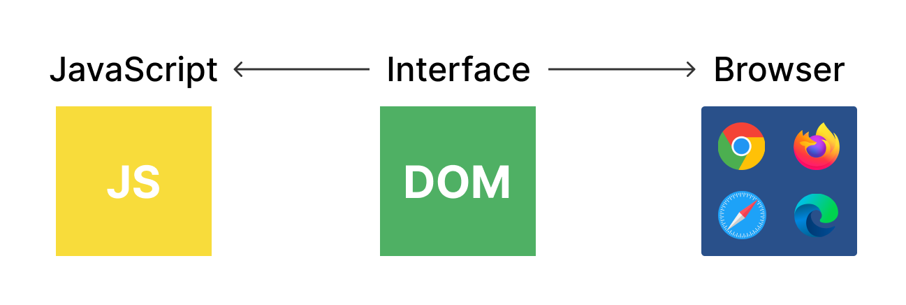

# Handling-DOM-with-JS
Practicas de escritorio del manejo del DOM con JavaScript

 

## DOM - DOCUMENT OBJECT MODEL - Estructura del Documento HTML
- Representacion del HTML

- Estructura de datos arbol

- Nodos

